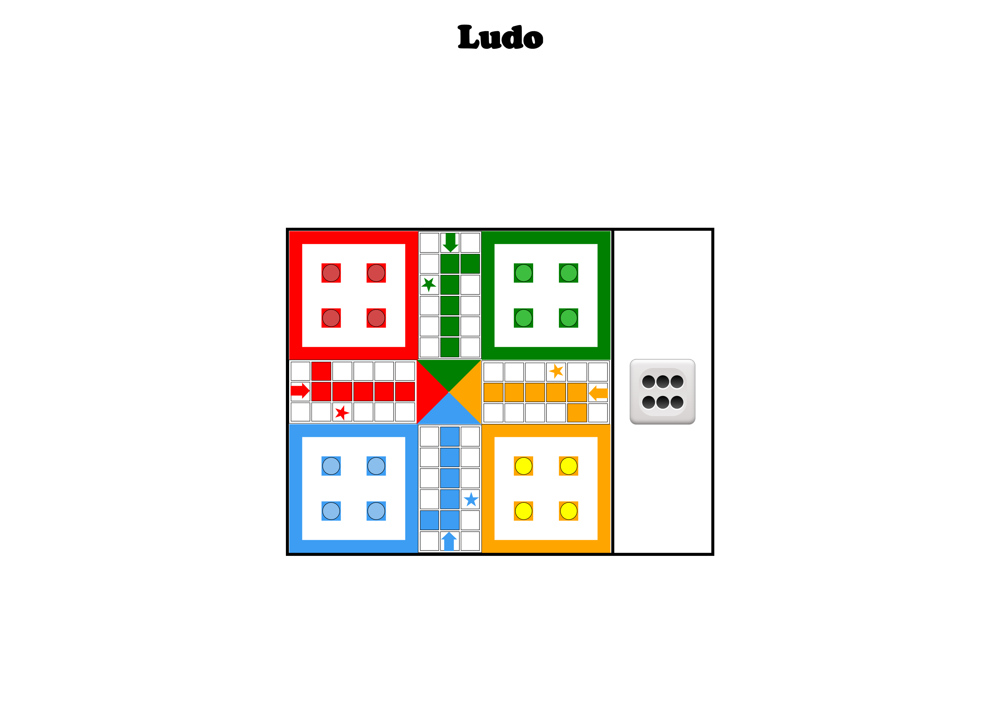
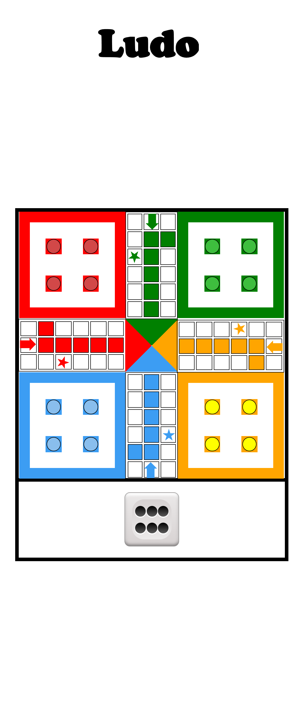

# **LUDO**

The project contains game of `ludo`. This is a fully responsive ludo game build purely on `REACT`. Utilised the efficient power of React Js to build full responsive ludo game. Learnt to use React Js to build production ready game in minimum possible time.

# Technologies Used
 `HTML`

 `CSS`

 `REACT`
# Features
 - Build over REACT
 - Clean and Beautiful UI Design
 - Fully Responsive Mobile Design
 # Website
 ## Desktop Version
 
 ## Mobile Version
 
